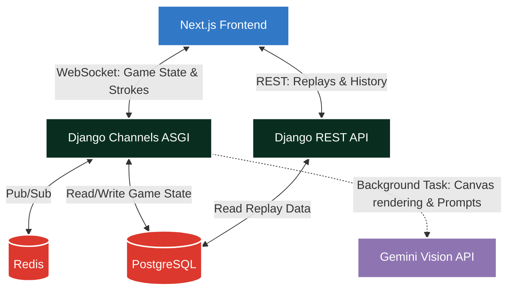

# Scribl.AI — Real-Time Multiplayer Drawing & AI Guessing Game

[](#) *(Placeholder for Demo Video)*


**Scribl.AI** is a high-performance, production-grade real-time multiplayer drawing and guessing web application. It features a rich tech stack bridging WebSockets, real-time canvas synchronization, and state-of-the-art AI integration. With features like Voice-Powered Guessing, an AI-powered smart bot that guesses human drawings, AI-generated drawing roasts, and server-side anti-cheat, Scribl.AI serves as a comprehensive portfolio showcase for full-stack engineering and AI orchestration.

---

## ✨ Features

- 🎨 **Real-Time Canvas Syncing**: Butter-smooth drawing replication via WebSocket and React state batching, supporting variable brush sizes, colors, undo, and clear.
- 🗣️ **Voice-Powered Guessing (Web Speech API)**: Hands-free gameplay! Speak your guess into the mic and watch it transcribe and submit automatically.
- 🤖 **Smart AI Player Bot ("Scribl-Bot")**: An AI peer powered by Gemini Vision that joins your game, renders the canvas strokes headlessly via Pillow, and attempts to guess your drawing dynamically.
- 🔥 **AI Drawing Roasts & Highlights**: After every round, Gemini Vision examines the final canvas and generates a funny, good-natured roast. At the end of the match, it picks a highlight drawing for a recap card.
- 🧙‍♂️ **AI Theme Word Packs**: Hosts can generate ~30 themed drawing words on the fly (e.g. "Bollywood Movies", "90s Retro") using Gemini AI.
- 🛡️ **Server-Side Anti-Cheat**: Secret words never reach the client unmasked (`_ _ _ _`). Robust point calculation prevents cheating.
- 📹 **Scrubbable Replays**: Every stroke is stored in PostgreSQL. Replay full rounds stroke-by-stroke through an interactive match history modal.
- 📱 **Mobile Responsive**: Fully responsive grid layouts, touch-enabled drawing canvas, and smart UI collapsing for cross-device compatibility.
- 📡 **Spectator Mode & Live Commentary**: Join as a spectator with a read-only UI and enjoy an AI-generated play-by-play shoutcast feed of the ongoing game.

---

## 🏗 Architecture Overview

Scribl.AI uses an async ASGI architecture with Redis acting as the Pub/Sub broker to handle hundreds of concurrent WebSocket messages. The AI layer operates in non-blocking background tasks to ensure the main game loop remains strictly real-time.



---

## 🚀 Quick Start with Docker Compose

### 1. Setup Environment Variables
```bash
cp .env.example .env
```
*(Optionally add your `GEMINI_API_KEY` to `.env` to enable live Gemini Vision guessing, AI roasts, and AI word pack generation. If unconfigured, Scribl-Bot and Roast Mode operate with resilient fallback responses.)*

### 2. Launch Application Services
```bash
docker-compose up --build
```

Access Next.js Frontend at: **`http://localhost:3000`**

### 3. Voice Guessing & Game Testing
1. Open Chrome/Edge at `http://localhost:3000`, enter a nickname and click **Create Room**.
2. Start Game -> when you are guessing, click the **Voice** button in the chat panel and allow microphone access.
3. Speak your guess into the mic to watch it transcribe and submit automatically!

---

## 🧪 Local Automated Testing

### Backend Unit Tests
```bash
cd backend
python manage.py test
```
Tests cover:
- Voice & typed guess validation through `submit_guess()`
- AI drawing roast generation & failure fallback non-blocking execution
- Match highlight recap generation & failure fallback non-blocking execution
- AI player creation, toggling, Pillow canvas rendering, and Gemini Vision API failure resilience

### Frontend Production Build
```bash
cd frontend
npm run build
```

---

## ☁️ Production Deployment

The application is structured to be deployed across three main services:
1. **Next.js Frontend** (Recommended: Vercel)
2. **Django Backend + ASGI** (Recommended: Render or Railway)
3. **PostgreSQL & Redis** (Render/Railway managed instances)

### Environment Variables Required

#### Backend (Render/Railway)
| Variable | Description |
|----------|-------------|
| `DJANGO_SETTINGS_MODULE` | Must be set to `scribl_backend.settings.prod` |
| `SECRET_KEY` | A long, secure random string for Django |
| `ALLOWED_HOSTS` | Comma-separated list of your backend domains (e.g. `api.yoursite.com,backend.onrender.com`) |
| `CORS_ALLOWED_ORIGINS` | Comma-separated frontend domains (e.g. `https://yoursite.com`) |
| `CSRF_TRUSTED_ORIGINS` | Same as CORS origins |
| `DATABASE_URL` | PostgreSQL connection string |
| `REDIS_URL` | Redis connection string (e.g. `redis://...`) |
| `GEMINI_API_KEY` | (Optional) Your Google Gemini API Key |

#### Frontend (Vercel)
| Variable | Description |
|----------|-------------|
| `NEXT_PUBLIC_API_URL` | URL of your deployed backend (e.g. `https://backend.onrender.com`) |
| `NEXT_PUBLIC_WS_URL` | WebSocket URL of your deployed backend (e.g. `wss://backend.onrender.com`) |

### Deployment Steps

#### 1. Database and Redis (Render/Railway)
- Provision a PostgreSQL database and a Redis instance on your chosen platform.
- Save the Internal or External Connection Strings for the backend setup.

#### 2. Backend Deployment (Render/Railway)
- Create a new Web Service pointing to your GitHub repository's `backend` directory.
- Build Command: `pip install -r requirements.txt`
- Start Command: `daphne -b 0.0.0.0 -p $PORT scribl_backend.asgi:application`
- **Important**: Add a release phase or run migrations manually: `python manage.py migrate`
- Set all required backend environment variables.

#### 3. Frontend Deployment (Vercel)
- Import your GitHub repository in Vercel.
- Set the Root Directory to `frontend`.
- Set the `NEXT_PUBLIC_API_URL` and `NEXT_PUBLIC_WS_URL` environment variables pointing to your deployed backend.
- Deploy!

### ⚠️ Common Pitfalls (CORS & WebSockets)
- Ensure your `NEXT_PUBLIC_WS_URL` uses `wss://` (secure WebSocket) in production, not `ws://`.
- If the frontend fails to connect to the backend API, double-check that your Vercel domain is strictly matched in `CORS_ALLOWED_ORIGINS` (with `https://` and no trailing slash).
